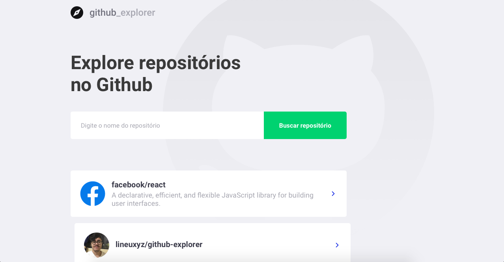
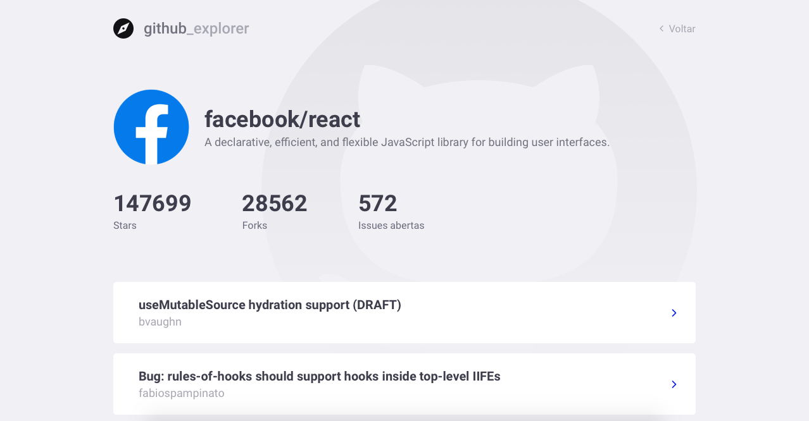
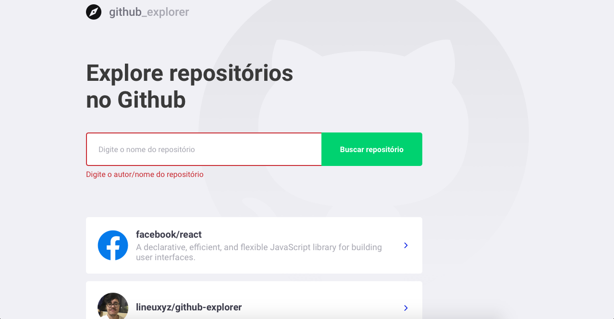

<h1 align="center">
    
</h1>

<h4 align="center">
	Github explorer
</h4>
<p align="center">
  

  

  <a href="https://www.linkedin.com/in/lineu-pastorelli-5165a7186">
    
  </a>

  <a href="https://github.com/lineuxyz/github-explorer/commits/master">
    
  </a>

  <a href="https://github.com/lineuxyz/github-explorer/blob/master/LICENSE">
  
  </a>
    

</p>
<p align="center">
  <a href="#-project">Project</a>&nbsp;&nbsp;&nbsp;|&nbsp;&nbsp;&nbsp;
  <a href="#🖥 Technologies">Technologies</a>&nbsp;&nbsp;&nbsp;|&nbsp;&nbsp;&nbsp;
  <a href="#layout">Layout</a>&nbsp;&nbsp;&nbsp;|&nbsp;&nbsp;&nbsp;
  <a href="#-how-to-use">How to use</a>&nbsp;&nbsp;&nbsp;|&nbsp;&nbsp;&nbsp;
  <a href="#-how-to-contribute">How to contribute</a>&nbsp;&nbsp;&nbsp;|&nbsp;&nbsp;&nbsp;
  <a href="#license">License</a>
</p>

## 📚 Project

Github explorer is a project in which you enter a repository and it will list a series of information about the repo, such as stars, issues, forks.

<h1 align="center">
    
</h1>


## 🖥 Technologies

This project was developed with the following technologies:

- [React](https://reactjs.org)
- [Github API](https://developer.github.com)

## 🔖 Layout

<p align="center">
  <h3 align="center">Aplication dashboard</h3>
  
  <h3 align="center">Aplication details</h3>
  
  <h3 align="center">Aplication error</h3>
  
</p>

## ❓ How To Use

To clone and run this application, you'll need [Git](https://git-scm.com), [Node.js][nodejs] + [Yarn][yarn] installed on your computer.

From your command line:

### Clone the project
```bash
# Clone this repository
$ git clone https://github.com/lineuxyz/github-explorer

# Go into the repository
$ cd github-explorer

# Install dependencies
$ yarn install

# Run project
$ yarn start
```

## 🤔 How to contribute

- Make a fork;
- Create a branck with your feature: `git checkout -b my-feature`;
- Commit changes: `git commit -m 'feat: My new feature'`;
- Make a push to your branch: `git push origin my-feature`.

After merging your receipt request to done, you can delete a branch from yours.

## 📜 License

This project is under the MIT license. See the [LICENSE](LICENSE.md) for details.

---

Made with ❤️ by [Lineu Pastorelli]()

[nodejs]: https://nodejs.org/
[yarn]: https://yarnpkg.com/
[vc]: https://code.visualstudio.com/
[vceditconfig]: https://marketplace.visualstudio.com/items?itemName=EditorConfig.EditorConfig
[vceslint]: https://marketplace.visualstudio.com/items?itemName=dbaeumer.vscode-eslint
[prettier]: https://marketplace.visualstudio.com/items?itemName=esbenp.prettier-vscode
